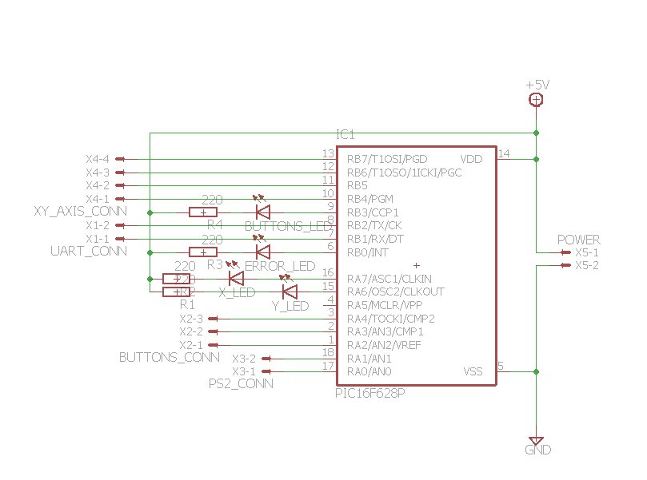
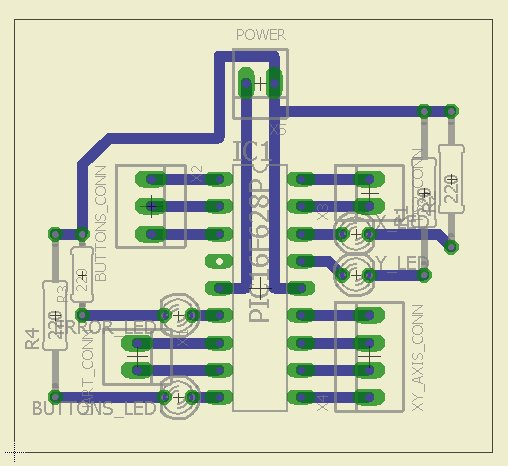
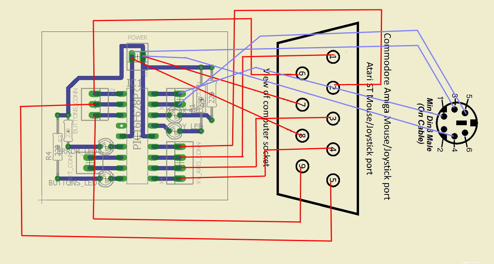

# A2Mouse
Atari/Amiga PS2 mouse

A small project to use a **PS2 mouse** on **Atari ST/Amiga**.  
I tested it only on *Atari 260 ST*, *Atari 1040 ST* & *Amiga 500*.  
I used a **PIC16F628A** (it was a PIC which i had at hand), 4 resistors (220Ohm) and 4 leds.

The mouse will be initialized at:

```
- Sample Rate = 80 samples/sec
- Resolution = 2 counts/mm
- Scaling = 1:1
- Mode of operation = Remote
```

The data will be sent to computer at aroud **300 updates/sec**

Leds are used to display the information which will be sent to computer:

- Clicking a mouse button
- X movement
- Y movement

On booting the leds are used to indicate the error conditions:

- Error led **->** cannot reset the mouse
- Error led & Button led **->** cannot set sample rate
- Error led & X axis led **->** cannot set resolution
- Error led & Y axis led **->** cannot set remote mode

## Compiled code
Here are the hex files which contain the compiled code for interfacing with [Atari](binaries/A2Mouse.production-atari.hex) and [Amiga](binaries/A2Mouse.production-amiga.hex)

## The schematic


## An example board


## Connection to Amiga/Atari port
The connection to Atari/Amiga port is the same and the communication is handled correctly from software.  


